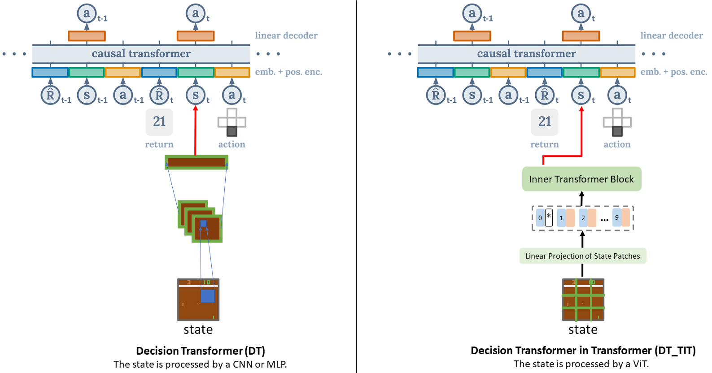

# Transformer in Transformer as Backbone for Deep Reinforcement Learning


## Overview
This is the official implementation of Transformer in Transformer (TIT) for Deep Reinforcement Learning.  
Contains scripts to reproduce experiments of the offline-SL (i.e., Decision Transformer and DT_TIT).


## Network Architecture

Decision Transformer (DT):  


DT vs DT_TIT:  




## Instructions

Our implementation is highly based on [Decision Transformer (DT)](https://github.com/kzl/decision-transformer).   

We provide code in two sub-directories:  
1. `gym` containing code for d4rl-MoJoCo experiments. Run `bash run.sh`, and it can reproduce our results shown in the paper.
2. `atari` containing code for d4rl-Atari experiments. Run `bash run.sh`, and it can run normally, but the results may be poor (our GPU was often OOM, so we didn't try Atari at all).


## Acknowledgements

Please cite Decision Transformer as:
```
@article{chen2021decisiontransformer,
  title={Decision Transformer: Reinforcement Learning via Sequence Modeling},
  author={Lili Chen and Kevin Lu and Aravind Rajeswaran and Kimin Lee and Aditya Grover and Michael Laskin and Pieter Abbeel and Aravind Srinivas and Igor Mordatch},
  journal={arXiv preprint arXiv:2106.01345},
  year={2021}
}
```

## License

MIT
